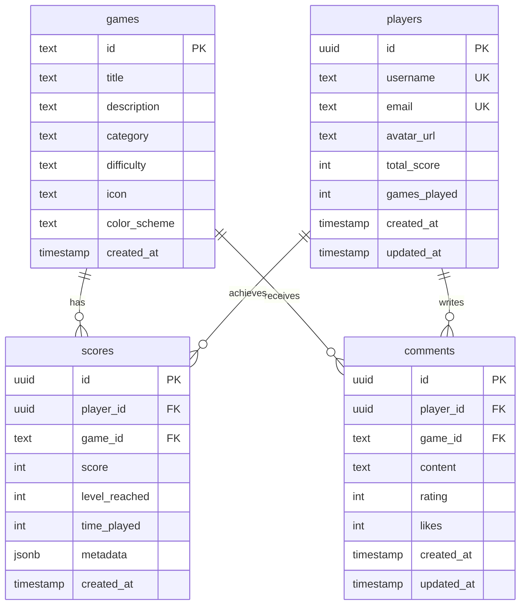

# 🎮 Retro GameHub

<div align="center">


**Una plataforma moderna de juegos retro desarrollada con Next.js**

[Demo en Vivo](https://retro-gamehub.vercel.app) • [Reportar Bug](https://github.com/tu-usuario/retro-gamehub/issues) • [Solicitar Feature](https://github.com/tu-usuario/retro-gamehub/issues)

</div>

---

## 📋 Tabla de Contenidos

- [🎯 Características](#-características)
- [🕹️ Juegos Disponibles](#️-juegos-disponibles)
- [🚀 Demo Rápida](#-demo-rápida)
- [⚙️ Instalación](#️-instalación)
- [🏗️ Tecnologías](#️-tecnologías)
- [📱 Experiencia Móvil](#-experiencia-móvil)
- [🗄️ Base de Datos](#️-base-de-datos)
- [🤝 Contribuir](#-contribuir)
- [📄 Licencia](#-licencia)

## 🎯 Características

### ✨ Experiencia de Usuario

- **🎨 Interfaz Moderna**: Diseño responsivo con animaciones fluidas
- **📱 Mobile-First**: Optimizado para dispositivos móviles y tablets
- **🌙 Tema Oscuro**: Interfaz elegante adaptada para gaming
- **⚡ Rendimiento**: Carga rápida y experiencia sin lag

### 🎮 Funcionalidades de Gaming

- **🏆 Sistema de Puntuación**: Rankings globales persistentes
- **👤 Perfiles de Usuario**: Estadísticas personalizadas
- **💬 Sistema de Comentarios**: Califica y comenta juegos
- **🔄 Tiempo Real**: Actualizaciones instantáneas con Supabase
- **📊 Estadísticas**: Tracking detallado de rendimiento

### 🛠️ Características Técnicas

- **📱 PWA Ready**: Instalable como aplicación móvil
- **🔒 Seguridad**: Políticas RLS y protección de datos
- **🌐 SEO Optimizado**: Meta tags y rendimiento optimizado
- **♿ Accesibilidad**: Cumple estándares WCAG

## 🕹️ Juegos Disponibles

<table>
<tr>
<td align="center" width="25%">

### 🐍 Snake Classic

_Género: Arcade_

El eterno clásico reinventado con controles modernos y gráficos mejorados.

**Controles:**

- 🖥️ **Desktop**: Flechas del teclado
- 📱 **Mobile**: Controles táctiles direccionales

**Objetivo:** Crece comiendo frutas sin chocar

</td>
<td align="center" width="25%">

### 🗡️ Fruit Ninja

_Género: Acción_

Demuestra tu destreza ninja cortando frutas volando por la pantalla.

**Controles:**

- 🖥️ **Desktop**: Movimiento del mouse
- 📱 **Mobile**: Gestos táctiles de corte

**Objetivo:** Corta frutas, evita bombas

</td>
<td align="center" width="25%">

### 🧱 Tetris Classic

_Género: Puzzle_

El legendario puzzle de bloques con mecánicas clásicas y controles modernos.

**Controles:**

- 🖥️ **Desktop**: Flechas + Espacio
- 📱 **Mobile**: Botones táctiles

**Objetivo:** Forma líneas completas

</td>
<td align="center" width="25%">

### 🏓 Pong Retro

_Género: Clásico_

El primer videojuego de la historia con IA mejorada y efectos visuales.

**Controles:**

- 🖥️ **Desktop**: Flechas ↑↓
- 📱 **Mobile**: Botones direccionales

**Objetivo:** Primer jugador en 10 puntos

</td>
</tr>
</table>

## 🚀 Demo Rápida

```bash
# Instalación rápida
git clone https://github.com/tu-usuario/retro-gamehub.git
cd retro-gamehub
npm install
npm run dev
```

Visita [http://localhost:3000](http://localhost:3000) y ¡comienza a jugar!

## ⚙️ Instalación

### 📋 Prerrequisitos

- **Node.js** 18.0+ ([Descargar](https://nodejs.org/))
- **npm** o **yarn**
- Cuenta en **Supabase** ([Crear gratis](https://supabase.com/))

### 🔧 Configuración Paso a Paso

<details>
<summary><strong>1. 📥 Clonar el Repositorio</strong></summary>

```bash
git clone https://github.com/tu-usuario/retro-gamehub.git
cd retro-gamehub
```

</details>

<details>
<summary><strong>2. 📦 Instalar Dependencias</strong></summary>

```bash
npm install
# o con yarn
yarn install
```

</details>

<details>
<summary><strong>3. 🔧 Configurar Variables de Entorno</strong></summary>

Crea un archivo `.env.local` en la raíz:

```env
# Supabase Configuration
NEXT_PUBLIC_SUPABASE_URL=https://tu-proyecto.supabase.co
NEXT_PUBLIC_SUPABASE_ANON_KEY=tu_clave_anonima

# Optional: Analytics
NEXT_PUBLIC_GA_ID=G-XXXXXXXXXX
```

</details>

<details>
<summary><strong>4. 🗄️ Configurar Base de Datos</strong></summary>

Ejecuta el siguiente SQL en el editor de Supabase:

```sql
-- Tabla de juegos
CREATE TABLE games (
  id TEXT PRIMARY KEY,
  title TEXT NOT NULL,
  description TEXT,
  category TEXT,
  difficulty TEXT,
  icon TEXT,
  color_scheme TEXT,
  created_at TIMESTAMP WITH TIME ZONE DEFAULT NOW()
);

-- Tabla de jugadores
CREATE TABLE players (
  id UUID DEFAULT gen_random_uuid() PRIMARY KEY,
  username TEXT UNIQUE NOT NULL,
  email TEXT UNIQUE,
  avatar_url TEXT,
  total_score INTEGER DEFAULT 0,
  games_played INTEGER DEFAULT 0,
  created_at TIMESTAMP WITH TIME ZONE DEFAULT NOW(),
  updated_at TIMESTAMP WITH TIME ZONE DEFAULT NOW()
);

-- Tabla de puntuaciones
CREATE TABLE scores (
  id UUID DEFAULT gen_random_uuid() PRIMARY KEY,
  player_id UUID REFERENCES players(id) ON DELETE CASCADE,
  game_id TEXT REFERENCES games(id) ON DELETE CASCADE,
  score INTEGER NOT NULL,
  level_reached INTEGER DEFAULT 1,
  time_played INTEGER,
  metadata JSONB,
  created_at TIMESTAMP WITH TIME ZONE DEFAULT NOW(),

  -- Índices para optimización
  INDEX idx_scores_game_score (game_id, score DESC),
  INDEX idx_scores_player (player_id),
  INDEX idx_scores_created (created_at DESC)
);

-- Tabla de comentarios
CREATE TABLE comments (
  id UUID DEFAULT gen_random_uuid() PRIMARY KEY,
  player_id UUID REFERENCES players(id) ON DELETE CASCADE,
  game_id TEXT REFERENCES games(id) ON DELETE CASCADE,
  content TEXT NOT NULL,
  rating INTEGER CHECK (rating >= 1 AND rating <= 5),
  likes INTEGER DEFAULT 0,
  created_at TIMESTAMP WITH TIME ZONE DEFAULT NOW(),
  updated_at TIMESTAMP WITH TIME ZONE DEFAULT NOW()
);

-- Insertar datos iniciales
INSERT INTO games (id, title, description, category, difficulty, icon, color_scheme) VALUES
('snake', 'Snake Classic', 'El clásico juego de la serpiente que nunca pasa de moda', 'Arcade', 'Fácil', '🐍', 'green'),
('fruit-ninja', 'Fruit Ninja', 'Corta frutas volando con precisión ninja', 'Acción', 'Medio', '🗡️', 'orange'),
('tetris', 'Tetris Classic', 'El legendario puzzle de bloques', 'Puzzle', 'Medio', '🧱', 'purple'),
('pong', 'Pong Retro', 'El primer videojuego de la historia', 'Clásico', 'Fácil', '🏓', 'gray');

-- Políticas de seguridad (RLS)
ALTER TABLE players ENABLE ROW LEVEL SECURITY;
ALTER TABLE scores ENABLE ROW LEVEL SECURITY;
ALTER TABLE comments ENABLE ROW LEVEL SECURITY;

-- Políticas básicas (ajustar según necesidades)
CREATE POLICY "Todos pueden leer players" ON players FOR SELECT USING (true);
CREATE POLICY "Todos pueden leer scores" ON scores FOR SELECT USING (true);
CREATE POLICY "Todos pueden leer comments" ON comments FOR SELECT USING (true);
```

</details>

<details>
<summary><strong>5. 🚀 Ejecutar el Proyecto</strong></summary>

```bash
# Desarrollo
npm run dev

# Producción
npm run build
npm start
```

</details>

## 🏗️ Tecnologías

### 🎨 Frontend

- **[Next.js 15](https://nextjs.org/)** - Framework React de producción
- **[React 18](https://reactjs.org/)** - Biblioteca de interfaces de usuario
- **[TypeScript](https://www.typescriptlang.org/)** - JavaScript tipado
- **[Tailwind CSS](https://tailwindcss.com/)** - Framework CSS utility-first
- **[Shadcn/ui](https://ui.shadcn.com/)** - Componentes UI modernos
- **[Lucide React](https://lucide.dev/)** - Iconos elegantes

### 🔧 Backend

- **[Supabase](https://supabase.com/)** - Backend como servicio
- **[PostgreSQL](https://postgresql.org/)** - Base de datos relacional
- **[Row Level Security](https://supabase.com/docs/guides/auth/row-level-security)** - Seguridad a nivel de fila

### 🛠️ Herramientas de Desarrollo

- **[ESLint](https://eslint.org/)** - Linting de código
- **[Prettier](https://prettier.io/)** - Formateo de código
- **[Husky](https://typicode.github.io/husky/)** - Git hooks
- **[Vercel](https://vercel.com/)** - Despliegue y hosting

## 📱 Experiencia Móvil

### 🎯 Diseño Mobile-First

Retro GameHub está diseñado con un enfoque mobile-first que garantiza una experiencia óptima en todos los dispositivos:

```
┌─────────────────┐
│   GAME CANVAS   │  ← Canvas optimizado para touch
│                 │
└─────────────────┘
┌─────────────────┐
│ [▶️ Play] [🔄 Reset] │  ← Controles accesibles sin scroll
└─────────────────┘
┌─────────────────┐
│   🎮 CONTROLES   │  ← Botones táctiles intuitivos
│    ⬆️ ⬇️ ⬅️ ➡️     │
└─────────────────┘
┌─────────────────┐
│ 📊 Score | ❤️ Lives │  ← Stats compactas
│ 📋 Instructions │
└─────────────────┘
```

### ✨ Características Móviles

- **👆 Controles Táctiles**: Botones optimizados para dedos
- **📱 Gestos Intuitivos**: Swipe y tap naturales
- **🔄 Sin Scroll Gaming**: Todos los controles visibles durante el juego
- **⚡ Rendimiento**: 60fps estables en dispositivos móviles
- **🎯 Precisión**: Área de toque amplia para mejor usabilidad

## 🗄️ Base de Datos

### 📊 Estructura de Datos



### 🔄 Funcionalidades en Tiempo Real

- **📈 Leaderboards Dinámicos**: Actualizaciones automáticas
- **💬 Comentarios Instantáneos**: Sin recargas necesarias
- **🏆 Notificaciones**: Nuevos records y logros
- **📊 Analytics**: Métricas de juego en tiempo real

### 🔒 Seguridad y Performance

- **🛡️ Row Level Security (RLS)**: Protección de datos por usuario
- **📚 Índices Optimizados**: Consultas rápidas en leaderboards
- **🔄 Cache Inteligente**: Reducción de llamadas a la API
- **⚡ Conexión Persistente**: WebSocket para actualizaciones en tiempo real

## 🎨 Personalización

### 🎨 Temas

```typescript
// Personalizar colores por juego
const gameThemes = {
  snake: { primary: "green", secondary: "emerald" },
  "fruit-ninja": { primary: "orange", secondary: "red" },
  tetris: { primary: "purple", secondary: "indigo" },
  pong: { primary: "gray", secondary: "slate" },
};
```

### 🎮 Agregar Nuevos Juegos

1. Crear componente del juego en `/app/games/[nombre]/`
2. Implementar lógica de puntuación
3. Agregar entrada en la base de datos
4. Configurar tema y metadatos

## 🧪 Testing

```bash
# Tests unitarios
npm run test

# Tests de integración
npm run test:integration

# Tests E2E con Cypress
npm run test:e2e

# Lighthouse CI (Performance)
npm run lighthouse
```

## 📈 Performance

### ⚡ Métricas de Rendimiento

- **🚀 First Contentful Paint**: < 1.5s
- **📱 Largest Contentful Paint**: < 2.5s
- **⚡ Time to Interactive**: < 3.5s
- **📊 Cumulative Layout Shift**: < 0.1
- **🎯 Lighthouse Score**: 95+

### 🔧 Optimizaciones Implementadas

- **📦 Code Splitting**: Carga bajo demanda
- **🖼️ Image Optimization**: WebP y lazy loading
- **📱 Service Worker**: Cache estratégico
- **⚡ Bundle Analysis**: Optimización de tamaño

## 🤝 Contribuir

¡Las contribuciones son bienvenidas! Aquí tienes cómo puedes ayudar:

### 🌟 Formas de Contribuir

- **🐛 Reportar Bugs**: Usa las [issues](https://github.com/tu-usuario/retro-gamehub/issues)
- **💡 Sugerir Features**: Comparte tus ideas
- **🎮 Agregar Juegos**: Desarrolla nuevos juegos retro
- **📚 Mejorar Documentación**: Ayuda a otros desarrolladores
- **🎨 Diseño UI/UX**: Mejoras visuales y de usabilidad

### 🔧 Proceso de Desarrollo

1. **🍴 Fork** el repositorio
2. **🌿 Crear branch** feature: `git checkout -b feature/amazing-game`
3. **💻 Desarrollar** siguiendo las convenciones del proyecto
4. **✅ Testing** completo antes de enviar
5. **📝 Commit** con mensajes descriptivos: `feat: add space invaders game`
6. **🚀 Push** y crear **Pull Request**

### 📋 Guidelines de Desarrollo

<details>
<summary><strong>🎯 Estándares de Código</strong></summary>

```typescript
// Usar TypeScript estricto
interface GameProps {
  onScoreUpdate: (score: number) => void;
  isPlaying: boolean;
}

// Componentes funcionales con hooks
export default function GameComponent({ onScoreUpdate, isPlaying }: GameProps) {
  const [score, setScore] = useState(0);

  // Lógica del juego...

  return <div className='game-container'>{/* JSX */}</div>;
}
```

</details>

<details>
<summary><strong>🎮 Estructura de Juegos</strong></summary>

```
app/games/[game-name]/
├── page.tsx              # Componente principal del juego
├── components/           # Componentes específicos
│   ├── GameCanvas.tsx   # Canvas del juego
│   ├── Controls.tsx     # Controles móviles/desktop
│   └── GameInfo.tsx     # Información y stats
├── hooks/               # Hooks personalizados
│   ├── useGameLogic.ts  # Lógica principal
│   └── useControls.ts   # Manejo de controles
└── utils/               # Utilidades del juego
    ├── gameEngine.ts    # Motor del juego
    └── scoring.ts       # Sistema de puntuación
```

</details>

### 🏆 Colaboradores

<a href="https://github.com/tu-usuario/retro-gamehub/graphs/contributors">
  
</a>

## 🚀 Deployment

### 📦 Vercel (Recomendado)

```bash
# Instalar Vercel CLI
npm i -g vercel

# Deploy
vercel --prod
```

### 🐳 Docker

```bash
# Build
docker build -t retro-gamehub .

# Run
docker run -p 3000:3000 retro-gamehub
```

### 🌍 Variables de Entorno en Producción

```env
# Supabase
NEXT_PUBLIC_SUPABASE_URL=https://xxx.supabase.co
NEXT_PUBLIC_SUPABASE_ANON_KEY=xxx

# Analytics (Opcional)
NEXT_PUBLIC_GA_ID=G-XXXXXXXXXX
NEXT_PUBLIC_HOTJAR_ID=XXXXXXX

# Seguridad
NEXTAUTH_SECRET=your-secret-key
NEXTAUTH_URL=https://your-domain.com
```

## 📊 Roadmap

### 🎯 Próximas Features

#### v1.1.0 - Q2 2024

- [ ] **🎮 Multiplayer**: Pong multijugador en tiempo real
- [ ] **🏆 Torneos**: Sistema de competencias
- [ ] **🎨 Temas**: Personalización visual
- [ ] **📱 PWA**: Instalación como app nativa

#### v1.2.0 - Q3 2024

- [ ] **🎮 Nuevos Juegos**: Pac-Man, Space Invaders
- [ ] **🤖 IA Mejorada**: Dificultad adaptativa
- [ ] **📊 Analytics**: Dashboard de estadísticas
- [ ] **🌍 i18n**: Soporte multiidioma

#### v2.0.0 - Q4 2024

- [ ] **🎮 Game Builder**: Editor de juegos visual
- [ ] **🔗 Blockchain**: NFTs y rewards
- [ ] **🤝 Social**: Sistema de amigos y chat
- [ ] **📺 Streaming**: Twitch integration

### 💡 Ideas para Contribuir

- **🎮 Más Juegos Retro**: Asteroids, Breakout, Centipede
- **🎨 Efectos Visuales**: Partículas, shaders, animaciones
- **🎵 Audio**: Música chiptune y efectos de sonido
- **🤖 IA**: Bots más inteligentes y adaptativos

## 📞 Soporte

### 🆘 ¿Necesitas Ayuda?

- **📖 Documentación**: [Wiki del proyecto](https://github.com/tu-usuario/retro-gamehub/wiki)
- **💬 Discord**: [Únete a la comunidad](https://discord.gg/retro-gamehub)
- **🐛 Issues**: [Reportar problemas](https://github.com/tu-usuario/retro-gamehub/issues)
- **📧 Email**: support@retro-gamehub.com

### 🔧 Troubleshooting Común

<details>
<summary><strong>🚨 Error de conexión a Supabase</strong></summary>

```bash
# Verificar variables de entorno
echo $NEXT_PUBLIC_SUPABASE_URL
echo $NEXT_PUBLIC_SUPABASE_ANON_KEY

# Reinstalar dependencias
rm -rf node_modules
npm install
```

</details>

<details>
<summary><strong>📱 Problemas en móvil</strong></summary>

```bash
# Verificar viewport
<meta name="viewport" content="width=device-width, initial-scale=1">

# Limpiar cache del navegador
# Chrome: Ctrl+Shift+R
# Safari: Cmd+Option+R
```

</details>

## 📄 Licencia

Este proyecto está bajo la licencia MIT. Ver el archivo [LICENSE](LICENSE) para más detalles.

```
MIT License

Copyright (c) 2024 Retro GameHub

Permission is hereby granted, free of charge, to any person obtaining a copy
of this software and associated documentation files (the "Software"), to deal
in the Software without restriction, including without limitation the rights
to use, copy, modify, merge, publish, distribute, sublicense, and/or sell
copies of the Software...
```

---

<div align="center">

---

<table>
<tr>
<td align="center">
<br/>
<strong>Retro GameHub</strong><br/>
<sub>Made with ❤️ by <a href="https://github.com/callejaj">Jorge Calleja</a></sub>
</td>
</tr>
</table>

⭐ **[Dale una estrella en GitHub](https://github.com/callejaj/retro-gamehub)** ⭐

**Links:** [🌐 Website](https://www.memento-academy.com) • [🎮 Demo](https://retro-gamehub.vercel.app) • [📧 Contact](mailto:callejaj@proton.me)

</div>
