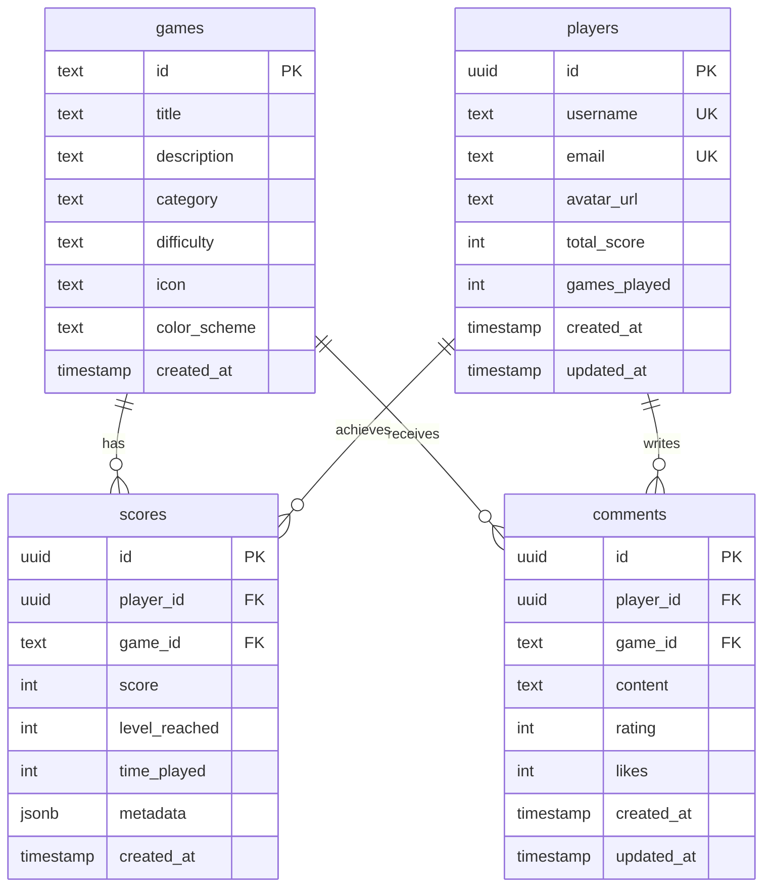

<div align="center">

# 🎮 Retro GameHub


**A modern retro gaming platform built with Next.js**

[🎮 Live Demo](https://retro-gamehub.vercel.app){: .btn .btn-primary}
[🐛 Report Bug](https://github.com/callejaj/retro-gamehub/issues){: .btn}
[💡 Request Feature](https://github.com/callejaj/retro-gamehub/issues){: .btn}

</div>

---

## 📋 Table of Contents

- [🎯 Features](#-features)
- [🕹️ Available Games](#️-available-games)
- [🚀 Quick Demo](#-quick-demo)
- [⚙️ Installation](#️-installation)
- [🏗️ Technologies](#️-technologies)
- [📱 Mobile Experience](#-mobile-experience)

## 🎯 Features

### ✨ User Experience

- **🎨 Modern Interface**: Responsive design with smooth animations
- **📱 Mobile-First**: Optimized for mobile devices and tablets
- **🌙 Dark Theme**: Elegant interface adapted for gaming
- **⚡ Performance**: Fast loading and lag-free experience

### 🎮 Gaming Features

- **🏆 Scoring System**: Persistent global rankings
- **👤 User Profiles**: Personalized statistics
- **💬 Comment System**: Rate and comment on games
- **🔄 Real Time**: Instant updates with Supabase
- **📊 Statistics**: Detailed performance tracking

### 🛠️ Technical Features

- **📱 PWA Ready**: Installable as mobile app
- **🔒 Security**: RLS policies and data protection
- **🌐 SEO Optimized**: Meta tags and optimized performance
- **♿ Accessibility**: Meets WCAG standards

## 🕹️ Available Games

<table>
<tr>
<td align="center" width="25%">

### 🐍 Snake Classic

_Genre: Arcade_

The eternal classic reinvented with modern controls and improved graphics.

**Controls:**

- 🖥️ **Desktop**: Keyboard arrows
- 📱 **Mobile**: Touch directional controls

**Objective:** Grow by eating fruits without crashing

</td>
<td align="center" width="25%">

### 🗡️ Fruit Ninja

_Genre: Action_

Show your ninja skills by slicing fruits flying across the screen.

**Controls:**

- 🖥️ **Desktop**: Mouse movement
- 📱 **Mobile**: Touch slicing gestures

**Objective:** Slice fruits, avoid bombs

</td>
<td align="center" width="25%">

### 🧱 Tetris Classic

_Genre: Puzzle_

The legendary block puzzle with classic mechanics and modern controls.

**Controls:**

- 🖥️ **Desktop**: Arrows + Spacebar
- 📱 **Mobile**: Touch gestures (swipe + tap)

**Objective:** Form complete lines

</td>
<td align="center" width="25%">

### 🏓 Pong Retro

_Genre: Classic_

The first video game in history with improved AI and visual effects.

**Controls:**

- 🖥️ **Desktop**: Arrows ↑↓
- 📱 **Mobile**: Directional buttons

**Objective:** First player to 10 points

</td>
</tr>
</table>

## 🚀 Quick Demo

```bash
# Quick installation
git clone https://github.com/callejaj/retro-gamehub.git
cd retro-gamehub
npm install
npm run dev
```

Visit [http://localhost:3000](http://localhost:3000) and start playing!

## ⚙️ Installation

### 📋 Prerequisites

- **Node.js** 18.0+ ([Download](https://nodejs.org/))
- **npm** or **yarn**
- **Supabase** account ([Create free](https://supabase.com/))

### 🔧 Step-by-Step Setup

<details>
<summary><strong>1. 📥 Clone Repository</strong></summary>

```bash
git clone https://github.com/callejaj/retro-gamehub.git
cd retro-gamehub
```

</details>

<details>
<summary><strong>2. 📦 Install Dependencies</strong></summary>

```bash
npm install
# or with yarn
yarn install
```

</details>

<details>
<summary><strong>3. 🔧 Configure Environment Variables</strong></summary>

Create a `.env.local` file in the root:

```env
# Supabase Configuration
NEXT_PUBLIC_SUPABASE_URL=https://your-project.supabase.co
NEXT_PUBLIC_SUPABASE_ANON_KEY=your_anon_key

# Optional: Analytics
NEXT_PUBLIC_GA_ID=G-XXXXXXXXXX
```

</details>

<details>
<summary><strong>4. 🗄️ Setup Database</strong></summary>

Run the following SQL in Supabase editor:

```sql
-- Games table
CREATE TABLE games (
  id TEXT PRIMARY KEY,
  title TEXT NOT NULL,
  description TEXT,
  category TEXT,
  difficulty TEXT,
  icon TEXT,
  color_scheme TEXT,
  created_at TIMESTAMP WITH TIME ZONE DEFAULT NOW()
);

-- Players table
CREATE TABLE players (
  id UUID DEFAULT gen_random_uuid() PRIMARY KEY,
  username TEXT UNIQUE NOT NULL,
  email TEXT UNIQUE,
  avatar_url TEXT,
  total_score INTEGER DEFAULT 0,
  games_played INTEGER DEFAULT 0,
  created_at TIMESTAMP WITH TIME ZONE DEFAULT NOW(),
  updated_at TIMESTAMP WITH TIME ZONE DEFAULT NOW()
);

-- Scores table
CREATE TABLE scores (
  id UUID DEFAULT gen_random_uuid() PRIMARY KEY,
  player_id UUID REFERENCES players(id) ON DELETE CASCADE,
  game_id TEXT REFERENCES games(id) ON DELETE CASCADE,
  score INTEGER NOT NULL,
  level_reached INTEGER DEFAULT 1,
  time_played INTEGER,
  metadata JSONB,
  created_at TIMESTAMP WITH TIME ZONE DEFAULT NOW()
);

-- Comments table
CREATE TABLE comments (
  id UUID DEFAULT gen_random_uuid() PRIMARY KEY,
  player_id UUID REFERENCES players(id) ON DELETE CASCADE,
  game_id TEXT REFERENCES games(id) ON DELETE CASCADE,
  content TEXT NOT NULL,
  rating INTEGER CHECK (rating >= 1 AND rating <= 5),
  likes INTEGER DEFAULT 0,
  created_at TIMESTAMP WITH TIME ZONE DEFAULT NOW(),
  updated_at TIMESTAMP WITH TIME ZONE DEFAULT NOW()
);

-- Insert initial data
INSERT INTO games (id, title, description, category, difficulty, icon, color_scheme) VALUES
('snake', 'Snake Classic', 'The classic snake game that never gets old', 'Arcade', 'Easy', '🐍', 'green'),
('fruit-ninja', 'Fruit Ninja', 'Slice flying fruits with ninja precision', 'Action', 'Medium', '🗡️', 'orange'),
('tetris', 'Tetris Classic', 'The legendary block puzzle game', 'Puzzle', 'Medium', '🧱', 'purple'),
('pong', 'Pong Retro', 'The first video game in history', 'Classic', 'Easy', '🏓', 'gray');

-- Row Level Security (RLS)
ALTER TABLE players ENABLE ROW LEVEL SECURITY;
ALTER TABLE scores ENABLE ROW LEVEL SECURITY;
ALTER TABLE comments ENABLE ROW LEVEL SECURITY;

-- Basic policies (adjust as needed)
CREATE POLICY "Everyone can read players" ON players FOR SELECT USING (true);
CREATE POLICY "Everyone can read scores" ON scores FOR SELECT USING (true);
CREATE POLICY "Everyone can read comments" ON comments FOR SELECT USING (true);
```

</details>

<details>
<summary><strong>5. 🚀 Run the Project</strong></summary>

```bash
# Development
npm run dev

# Production
npm run build
npm start
```

</details>

## 🏗️ Technologies

### 🎨 Frontend

- **[Next.js 15](https://nextjs.org/)** - Production React framework
- **[React 18](https://reactjs.org/)** - User interface library
- **[TypeScript](https://www.typescriptlang.org/)** - Typed JavaScript
- **[Tailwind CSS](https://tailwindcss.com/)** - Utility-first CSS framework
- **[Shadcn/ui](https://ui.shadcn.com/)** - Modern UI components
- **[Lucide React](https://lucide.dev/)** - Elegant icons

### 🔧 Backend

- **[Supabase](https://supabase.com/)** - Backend as a service
- **[PostgreSQL](https://postgresql.org/)** - Relational database
- **[Row Level Security](https://supabase.com/docs/guides/auth/row-level-security)** - Row-level security

### 🛠️ Development Tools

- **[ESLint](https://eslint.org/)** - Code linting
- **[Prettier](https://prettier.io/)** - Code formatting
- **[Husky](https://typicode.github.io/husky/)** - Git hooks
- **[Vercel](https://vercel.com/)** - Deployment and hosting

## 📱 Mobile Experience

### 🎯 Mobile-First Design

Retro GameHub is designed with a mobile-first approach that ensures optimal experience on all devices:

```
┌─────────────────┐
│   GAME CANVAS   │  ← Touch-optimized canvas
│                 │
└─────────────────┘
┌─────────────────┐
│ [▶️ Play] [🔄 Reset] │  ← Controls accessible without scroll
└─────────────────┘
┌─────────────────┐
│   🎮 CONTROLS   │  ← Intuitive touch controls
│    ⬆️ ⬇️ ⬅️ ➡️     │
└─────────────────┘
┌─────────────────┐
│ 📊 Score | ❤️ Lives │  ← Compact stats
│ 📋 Instructions │
└─────────────────┘
```

### ✨ Mobile Features

- **👆 Touch Controls**: Finger-optimized buttons
- **📱 Intuitive Gestures**: Natural swipe and tap
- **🔄 No-Scroll Gaming**: All controls visible during gameplay
- **⚡ Performance**: Stable 60fps on mobile devices
- **🎯 Precision**: Large touch areas for better usability

### 🎮 Advanced Touch Controls

- **Tetris**: Gesture-based controls (swipe to move, tap to rotate, hold for fast drop)
- **Fruit Ninja**: Direct canvas slicing with touch tracking
- **Snake**: Directional swipe controls with haptic feedback
- **Pong**: Precise paddle control with touch sensitivity

## 🗄️ Database

### 📊 Data Structure



### 🔄 Real-Time Features

- **📈 Dynamic Leaderboards**: Automatic updates
- **💬 Instant Comments**: No reloads needed
- **🏆 Notifications**: New records and achievements
- **📊 Analytics**: Real-time game metrics

### 🔒 Security and Performance

- **🛡️ Row Level Security (RLS)**: User data protection
- **📚 Optimized Indexes**: Fast leaderboard queries
- **🔄 Smart Cache**: Reduced API calls
- **⚡ Persistent Connection**: WebSocket for real-time updates

## 🎨 Customization

### 🎨 Themes

```typescript
// Customize colors per game
const gameThemes = {
  snake: { primary: "green", secondary: "emerald" },
  "fruit-ninja": { primary: "orange", secondary: "red" },
  tetris: { primary: "purple", secondary: "indigo" },
  pong: { primary: "gray", secondary: "slate" },
};
```

### 🎮 Adding New Games

1. Create game component in `/app/games/[name]/`
2. Implement scoring logic
3. Add database entry
4. Configure theme and metadata

## 🧪 Testing

```bash
# Unit tests
npm run test

# Integration tests
npm run test:integration

# E2E tests with Cypress
npm run test:e2e

# Lighthouse CI (Performance)
npm run lighthouse
```

## 📈 Performance

### ⚡ Performance Metrics

- **🚀 First Contentful Paint**: < 1.5s
- **📱 Largest Contentful Paint**: < 2.5s
- **⚡ Time to Interactive**: < 3.5s
- **📊 Cumulative Layout Shift**: < 0.1
- **🎯 Lighthouse Score**: 95+

### 🔧 Implemented Optimizations

- **📦 Code Splitting**: On-demand loading
- **🖼️ Image Optimization**: WebP and lazy loading
- **📱 Service Worker**: Strategic caching
- **⚡ Bundle Analysis**: Size optimization

## 🤝 Contributing

Contributions are welcome! Here's how you can help:

### 🌟 Ways to Contribute

- **🐛 Report Bugs**: Use [issues](https://github.com/callejaj/retro-gamehub/issues)
- **💡 Suggest Features**: Share your ideas
- **🎮 Add Games**: Develop new retro games
- **📚 Improve Documentation**: Help other developers
- **🎨 UI/UX Design**: Visual and usability improvements

### 🔧 Development Process

1. **🍴 Fork** the repository
2. **🌿 Create branch** feature: `git checkout -b feature/amazing-game`
3. **💻 Develop** following project conventions
4. **✅ Test** thoroughly before submitting
5. **📝 Commit** with descriptive messages: `feat: add space invaders game`
6. **🚀 Push** and create **Pull Request**

### 📋 Development Guidelines

<details>
<summary><strong>🎯 Code Standards</strong></summary>

```typescript
// Use strict TypeScript
interface GameProps {
  onScoreUpdate: (score: number) => void;
  isPlaying: boolean;
}

// Functional components with hooks
export default function GameComponent({ onScoreUpdate, isPlaying }: GameProps) {
  const [score, setScore] = useState(0);

  // Game logic...

  return <div className='game-container'>{/* JSX */}</div>;
}
```

</details>

<details>
<summary><strong>🎮 Game Structure</strong></summary>

```
app/games/[game-name]/
├── page.tsx              # Main game component
├── components/           # Specific components
│   ├── GameCanvas.tsx   # Game canvas
│   ├── Controls.tsx     # Mobile/desktop controls
│   └── GameInfo.tsx     # Information and stats
├── hooks/               # Custom hooks
│   ├── useGameLogic.ts  # Main logic
│   └── useControls.ts   # Control handling
└── utils/               # Game utilities
    ├── gameEngine.ts    # Game engine
    └── scoring.ts       # Scoring system
```

</details>

### 🏆 Contributors

<a href="https://github.com/callejaj/retro-gamehub/graphs/contributors">
  
</a>

## 🚀 Deployment

### 📦 Vercel (Recommended)

```bash
# Install Vercel CLI
npm i -g vercel

# Deploy
vercel --prod
```

### 🐳 Docker

```bash
# Build
docker build -t retro-gamehub .

# Run
docker run -p 3000:3000 retro-gamehub
```

### 🌍 Production Environment Variables

```env
# Supabase
NEXT_PUBLIC_SUPABASE_URL=https://xxx.supabase.co
NEXT_PUBLIC_SUPABASE_ANON_KEY=xxx

# Analytics (Optional)
NEXT_PUBLIC_GA_ID=G-XXXXXXXXXX
NEXT_PUBLIC_HOTJAR_ID=XXXXXXX

# Security
NEXTAUTH_SECRET=your-secret-key
NEXTAUTH_URL=https://your-domain.com
```

## 📊 Roadmap

### 🎯 Upcoming Features

#### v1.1.0 - Q2 2024

- [ ] **🎮 Multiplayer**: Real-time multiplayer Pong
- [ ] **🏆 Tournaments**: Competition system
- [ ] **🎨 Themes**: Visual customization
- [ ] **📱 PWA**: Native app installation

#### v1.2.0 - Q3 2024

- [ ] **🎮 New Games**: Pac-Man, Space Invaders
- [ ] **🤖 Improved AI**: Adaptive difficulty
- [ ] **📊 Analytics**: Statistics dashboard
- [ ] **🌍 i18n**: Multi-language support

#### v2.0.0 - Q4 2024

- [ ] **🎮 Game Builder**: Visual game editor
- [ ] **🔗 Blockchain**: NFTs and rewards
- [ ] **🤝 Social**: Friends system and chat
- [ ] **📺 Streaming**: Twitch integration

### 💡 Ideas for Contributing

- **🎮 More Retro Games**: Asteroids, Breakout, Centipede
- **🎨 Visual Effects**: Particles, shaders, animations
- **🎵 Audio**: Chiptune music and sound effects
- **🤖 AI**: Smarter and adaptive bots

## 📞 Support

### 🆘 Need Help?

- **📖 Documentation**: [Project Wiki](https://github.com/callejaj/retro-gamehub/wiki)
- **💬 Discord**: [Join community](https://discord.gg/retro-gamehub)
- **🐛 Issues**: [Report problems](https://github.com/callejaj/retro-gamehub/issues)
- **📧 Email**: support@retro-gamehub.com

### 🔧 Common Troubleshooting

<details>
<summary><strong>🚨 Supabase connection error</strong></summary>

```bash
# Check environment variables
echo $NEXT_PUBLIC_SUPABASE_URL
echo $NEXT_PUBLIC_SUPABASE_ANON_KEY

# Reinstall dependencies
rm -rf node_modules
npm install
```

</details>

<details>
<summary><strong>📱 Mobile issues</strong></summary>

```bash
# Check viewport
<meta name="viewport" content="width=device-width, initial-scale=1">

# Clear browser cache
# Chrome: Ctrl+Shift+R
# Safari: Cmd+Option+R
```

</details>

## 📄 License

This project is licensed under the MIT License. See the [LICENSE](LICENSE) file for details.

```
MIT License

Copyright (c) 2024 Retro GameHub

Permission is hereby granted, free of charge, to any person obtaining a copy
of this software and associated documentation files (the "Software"), to deal
in the Software without restriction, including without limitation the rights
to use, copy, modify, merge, publish, distribute, sublicense, and/or sell
copies of the Software...
```

---

<div align="center">

---

<table>
<tr>
<td align="center">
<br/>
<strong>Retro GameHub</strong><br/>
<sub>Made with ❤️ by <a href="https://github.com/callejaj">Jorge Calleja</a></sub>
</td>
</tr>
</table>

⭐ **[Give a star on GitHub](https://github.com/callejaj/retro-gamehub)** ⭐

**Links:** [🌐 Website](https://www.memento-academy.com) • [🎮 Demo](https://retro-gamehub.vercel.app) • [📧 Contact](mailto:callejaj@proton.me)

</div>
